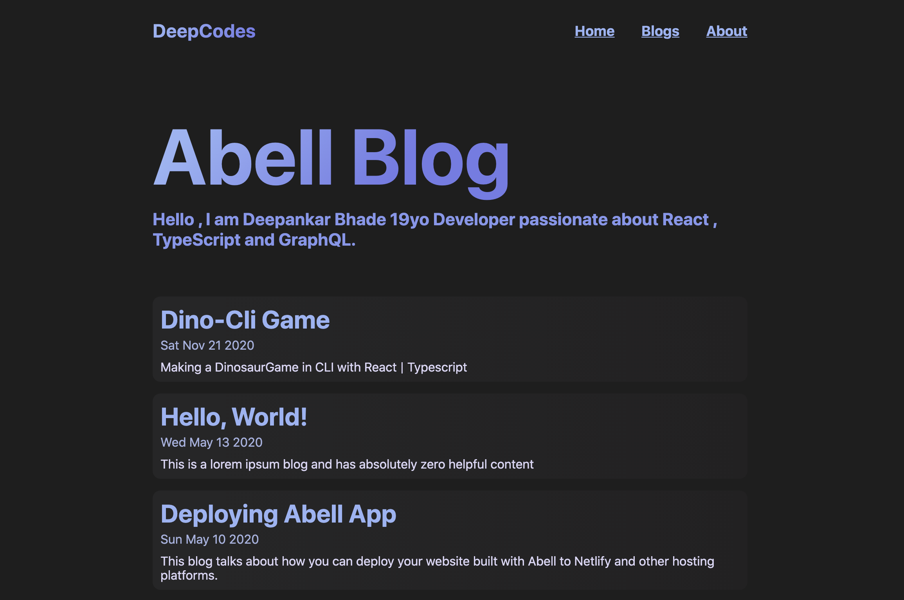

## 🚀 Abell Blog Template

[Preview it Live](https://abell-blog.netlify.app/)



### About Abell :

a JavaScript based static-site-generator to help you create JSON, Markdown, or static-data based websites with minimal setup in a syntax you almost already know. Built on top of [abelljs/abell-renderer](https://github.com/abelljs/abell-renderer).

**Documentation:** https://abelljs.org

## 📖 &nbsp; Create Abell Project

```sh
npx create-abell-app my-blog
cd my-blog
npm run dev
```

Check out https://abelljs.org for complete documentation.
